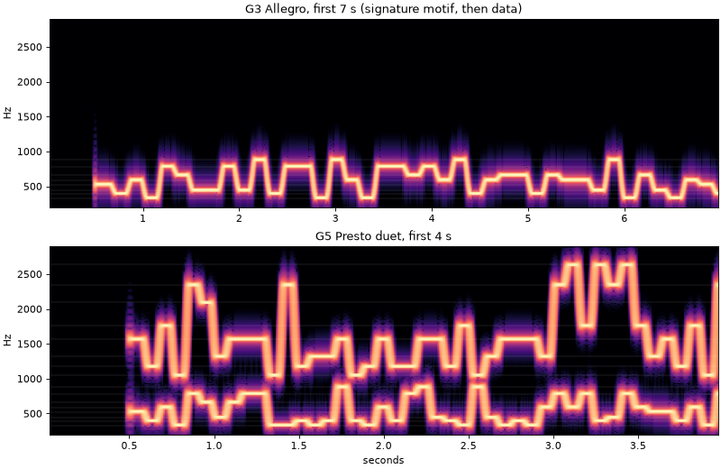

# Glissando

A weak-signal amateur radio digital mode that sounds like someone 
whistling a bright and warm tune -- or, alternatively, 
murderous bleeping robot minions. 

Every symbol is a glide (a chirp) from one note of the selected scales
to the next, followed by a short sustain. The data is the melody. The
signal is constant-envelope, phase-continuous and fits inside an ordinary
SSB passband. Like LoRa, it reaches below the noise by using a large set of
orthogonal chirps, long integration and strong FEC; unlike LoRa, the chirps
are chosen so that any sequence of them, and any two of them at once, is
consonant. It shifts gears (tempo) to match the HF path.

| Gear | Tempo | Symbol | Transmission | 50 % decode, AWGN / CCIR poor (dB, 2500 Hz) |
|------|-------|--------|--------------|-----------------------|
| G1 | Adagio | 640 ms | 55 s | -26.5 / -23.0 |
| G2 | Andante | 320 ms | 27.5 s | -23.6 / -20.8 |
| G3 | Allegro | 160 ms | 13.8 s | -20.4 / -17.6 |
| G4 | Presto | 80 ms | 6.9 s | -17.4 / -14.2 |
| G5 | Presto duet | 80 ms x 2 voices | 6.9 s (2 messages) | -14.1 / -10.8 |

- Design and trade-offs: [docs/DESIGN.md](docs/DESIGN.md)
- How the receiver hears a chirp, explained from first principles
  (matched filters, LoRa-style dechirping, the note trellis):
  [docs/HOW_IT_HEARS.md](docs/HOW_IT_HEARS.md)
- The chord that opens and closes each transmission, and why it is for
  the ear and not the receiver: [docs/CHORDS.md](docs/CHORDS.md)
- Listen: [samples/](samples/) (8 kHz WAV; `g3-allegro-moderate-hf-minus10db.wav`
  is what it sounds like through a fading HF path at -10 dB SNR)
- Modes: see [Scales](#scales) below for the pentatonic default and the
  three tritone modes
- Prototype: [prototype/](prototype/) (Python 3 + NumPy)
- Modem in C++: [modem/](modem/), a real-time port of the prototype
  (streaming receiver, all gears at once), tested against it
- App: [app/](app/), a desktop console dressed as Chaotica's control room,
  with a visi-scope waterfall, tuning and gear controls, and text chat
  carried as Glissando melodies. Build and run notes:
  [docs/APP.md](docs/APP.md). It started from FreeDV and keeps FreeDV's
  LGPL 2.1 licence (`app/COPYING`); the rest of the repository is MIT.

```sh
cd prototype
python3 -m pip install numpy matplotlib
python3 render.py                    # listening samples + spectrogram
python3 sim.py --gears 3 --trials 20 # decode-probability sweep
python3 bench.py --backend pulse --null-sink --gears 4 --snr -16 -14 -12
                                     # same sweep through PulseAudio (Linux):
                                     # a null-sink loopback, or --sink/--source
                                     # for a rig's sound card
python3 -m pytest                    # tests (the PulseAudio test skips without a server)
```

## Scales

The alphabet of eight notes is a parameter (`--scale` on `sim.py` and
`bench.py`, `SCALES` in `glissando.py`). Two families are included.

**Pentatonic** (the default, `pentatonic`): A minor pentatonic, E4 to A5. It
has no semitones and no tritone, so every pair of notes is consonant. Any
data sequence is a tune, and whatever overlaps the signal on an HF band, a
multipath echo, the duet's second voice, or another Glissando station in
the same key, lands on it as harmony. Its interference with itself is
pleasant, which is the point of the mode.

**Tritone** modes (`wholetone`, `diminished`, `diabolus`): the same modem
gliding between notes built on the devil's interval. They sound like the
bleeping computers of an evil mastermind's lair in *The Adventures of
Captain Proton*: whole-tone runs, diminished scurries, and two major triads
a tritone apart. Each scale maps onto itself under a tritone, so the duet's
two voices are a tritone apart as well.

| scale | low voice | flavour |
|---|---|---|
| `pentatonic` | E4 G4 A4 C5 D5 E5 G5 A5 | whistled folk tune; overlaps are harmony |
| `wholetone` | E4 F#4 G#4 A#4 C5 D5 E5 F#5 | dreamlike, no centre; notes 3 steps apart are a tritone |
| `diminished` | E4 F4 G4 G#4 A#4 B4 C#5 D5 | half-whole octatonic; every note has its tritone in the scale |
| `diabolus` | E4 G#4 A#4 B4 D5 E5 F5 G#5 | E major and Bb major triads a tritone apart |

They cost nothing in sensitivity: at G3 Allegro all four scales decode at
the same SNR within 0.5 dB (DESIGN.md 3.1a has the table). The receiver hears
all four at once and says which one each station sang in, so the forces of
good in pentatonic white can chat with Chaotica's diabolus henchmen, each in
their own key, at no cost in sensitivity or false decodes (DESIGN.md 3.1b). Listen in
`samples/`: `g3-allegro-<scale>.wav` for a solo and
`g5-presto-duet-<scale>.wav` for the duet.

## Intention

This work represents a long-standing dream of the inventor: to make amateur radio
bands sound better, and to encourage harmonious interoperability.

## More Information
[Visit us on Discord: https://discord.gg/za4eYraFdX](https://discord.gg/za4eYraFdX)


