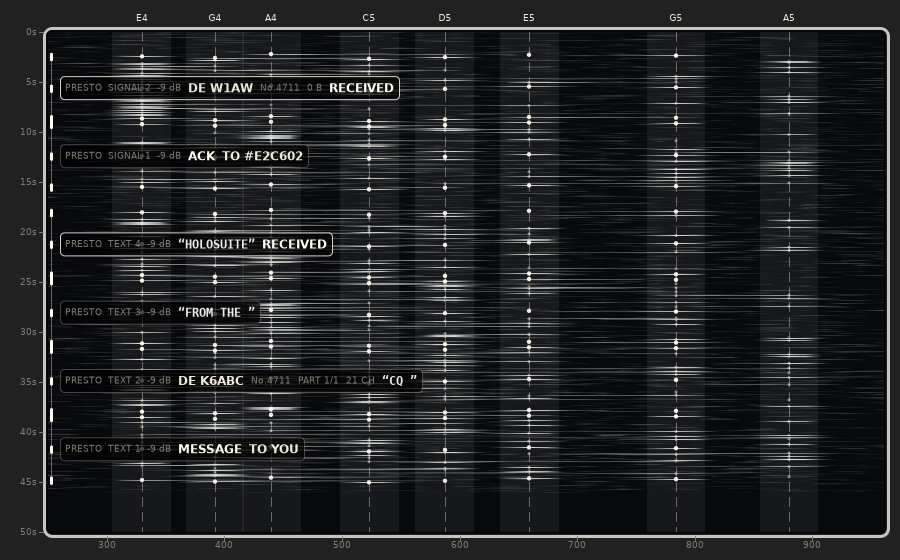
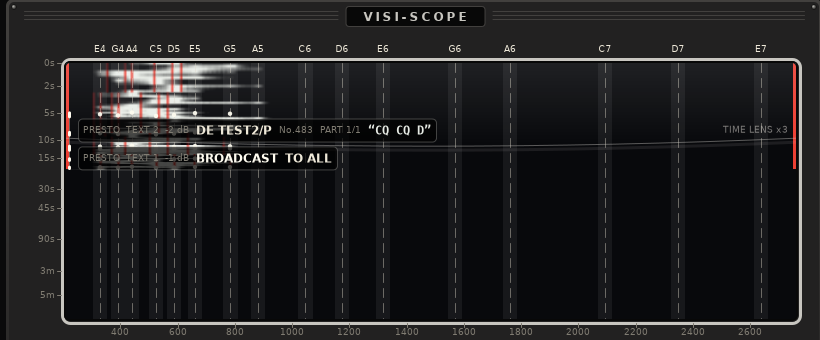
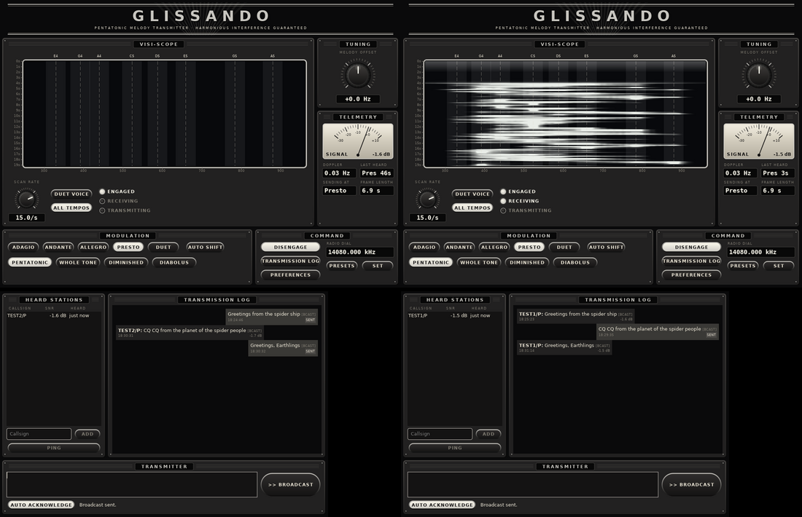

# The Glissando app

A desktop front end for Glissando (`docs/DESIGN.md`): a console with the
visi-scope waterfall, tuning and the mode's options, and a COMMS window for text chat
whose messages go out as Glissando melodies. It lives in `app/`, and the C++
modem it uses lives in `modem/`, beside the NumPy prototype in `prototype/`
that the modem's tests are checked against.

## Where it came from

`app/` started as a copy of
[baitisj/freedv-gui](https://github.com/baitisj/freedv-gui), branch
`claude/glissando-frontend-xwberv` at commit fa6a931 (itself Jeff's
`text-messaging` fork of FreeDV 2.4.1), so it keeps FreeDV's licence:
`app/COPYING` (LGPL 2.1) covers everything under `app/`. The rest of this
repository, `modem/` included, is MIT (`LICENSE`).

It is the Glissando app, not a FreeDV release. Voice is outside its scope:
it has no voice controls, no FreeDV main window, no FreeDV Reporter and no
FreeDV Help menu, and text chat runs over Glissando. It does not carry RADE
either, and the FreeDV voice modem is gone: nothing demodulates voice, and
the console's waterfall takes its spectrum from its own FFT of the radio
input. The codec2 library is still built in underneath for its data modes,
which chat falls back to only if the console is closed. The shared
[freedv-backend](https://github.com/tmiw/freedv-backend) library is no
longer fetched at configure time: `app/backend/` holds a copy of it with RADE,
RADE text, FARGAN and the Opus bandwidth expander taken out (see
`app/backend/README.md`). Settings a FreeDV build wrote, such as a saved
voice mode or squelch level, are ignored.

## Building and running (Linux)

Packages on Debian or Ubuntu:

    sudo apt install build-essential cmake git autoconf automake libtool \
        libwxgtk3.2-dev libpulse-dev libspeexdsp-dev libsndfile1-dev \
        libhamlib-dev libasound2-dev libao-dev libgsm1-dev

Then, from the top of the repository:

    cmake -S app -B build -DUSE_NATIVE_AUDIO=1 -DUNITTEST=ON -DCMAKE_BUILD_TYPE=Release
    cmake --build build -j
    ./build/src/glissando

Without a build type the build is Debug, and an unoptimised receiver cannot
keep up with listening on every tempo at once: decodes fall further and
further behind the air.

The first configure fetches libsamplerate from GitHub. `ctest --test-dir build -R
"glissando|text_messaging"` runs the modem and chat tests.

## Two floating windows

Both open at launch:

* **The console**, the application's window: the visi-scope waterfall,
  tuning, the mode's modulation options, the radio's dial and the setup
  dialogs, dressed as Chaotica's control room from the Captain Proton
  holonovel. Closing it quits.
* **The COMMS window** ("Glissando COMMS"), where chat is sent and read:
  heard stations, the log of messages and the transmitter, in the same dress.
  Closing it only hides it; `Comms` on the console brings it back, and
  flashes red while it is closed and a message for you, or for all, has come
  in.
* **The snooping window** ("Glissando Snooper"): every message the station
  hears, including directed messages between other stations, which the chat
  window leaves out. Messages for you are lit and marked FOR YOU. The
  pings, pongs and acknowledgements around them are listed in small print, and
  `Every frame` adds each fragment as it is decoded. An addressee that has
  never been heard transmitting shows as `#` and the CRC of its callsign,
  because frames carry only that. Closing it only hides it; `Snooper` on the
  console brings it back with everything heard meanwhile.

The COMMS and snooping windows come back at launch only if they were open
when the app last closed.

`--glissando` is still accepted, so older scripts keep working, but it no
longer changes anything.

## Controls

| Control | What it does |
| --- | --- |
| Visi-scope | Receive spectrum over the melody's part of the passband, white phosphor on black. The scale's notes are ruled across it with the receiver's +/-25 Hz search band shaded. Double click to put the lowest note where you clicked; mouse wheel nudges the tuning 0.1 Hz a click, 10 Hz with shift, 1 Hz with control. |
| Decoded frames | Every frame the receiver decodes is written back on the visi-scope where it was heard, and scrolls down with it. Its held notes are lit over the phosphor (the three signature motifs brighter, and marked as bars down the left edge), and a caption beside it reads out what that frame added to the chat frame, which Glissando carries nine bytes at a time: first the header fields as each one becomes whole (MESSAGE, TO YOU, DE K6ABC, the message number, which part of how many), then the characters of the text. A frame that finishes a chat frame says RECEIVED. Frames addressed to other stations are written up too. |
| Scan rate | Waterfall rows per second, 0.5 to 20. |
| Carrier sense in red | While something holds the transmit queue, both edges of each row drawn are red. The notes carrier sense is listening to are painted red: the opening chord's E4 and D5 when it hears a chord, the scale it hears singing after it, or the notes of the last frame decoded while its burst, closing chord or CW tail holds the channel. A dim red line is where it listens; a bright red line is what it hears there. Red edges with no red notes are a hold from what a frame said (a station with more bursts to come), not from anything sounding. |
| Time lens | On by default. The top of the visi-scope works like an elongated convex lens: the newest rows are drawn three pixels tall, and further down the time scale eases into a logarithmic one (`y = K asinh(age / tau)`), so older history moves down ever more slowly and eight times as much of it stays on screen as without the lens. Where several rows share a pixel the brightest wins, so an old, weak melody is squeezed but never averaged away. The rim marked TIME LENS x3 is where one row takes one pixel. The time scale on the left follows the lens. Off: one row per pixel, as before. |
| Duet voice | Widens the scope to show the duet gear's high voice (C6..E7). The history is kept across the whole band, so widening, narrowing or retuning the scope redraws what was heard on the new scale rather than wiping it. |
| All tempos | Decode every gear at once, so a station that shifts gear is still heard. Off: only the chosen gear (and the one automatic shifting picked). |
| Melody offset | Moves every note by up to +/-250 Hz, on transmit and receive: the audio equivalent of the tuning dial. Mouse wheel: 0.1 Hz a click, 10 Hz with shift, 1 Hz with control. Dragging catches at 0 Hz, and a double click returns there. |
| Radio dial | Shows the rig frequency, read from the radio once a second and again just before each keying (the radio is not read while it transmits). The radio is the source of truth: turning its dial or retuning it with `rigctl` shows here, and the app never puts it back. Only `Presets` (the frequency list, edited in Preferences, Options) and `Set` (a typed frequency) retune the radio; one picked while disengaged is sent when the radio connects. Starting and stopping leave the radio where it is. The US data segment check follows the shown frequency. |
| Drive | The transmit audio level, -30 dB to 0 dB, with -12 dB straight up (full scale from the sound card drives most radios deep into ALC; an IC-7100 reads a little over 0.5 at -12 dB). Each half of the sweep turns evenly, so the top quarter of the knob covers -12 to 0 dB and the rest -30 to -12 dB. Drag it (it catches straight up) or turn the mouse wheel, 0.5 dB a click, 0.1 dB with shift. Click it to push it in: a ring lights around it, and while transmitting the radio's ALC is read once a second (radios whose Hamlib backend reports ALC, the IC-7100 among them). Two readings in a row over the ALC Target (0.5 unless changed in Preferences, Rig control, under the Hamlib settings) turn the level down 0.5 dB; one over 0.8 turns it down 2 dB; the ring flashes red as it does. Pushed in it only ever turns down, never louder than where it was pushed in. To go louder, click it out, turn it up and push it in again; turning it while it is in pops it out. |
| Tempo | Adagio (640 ms notes, 55 s frame), Andante, Allegro, Presto (80 ms, 7 s), Duet (two voices, two payloads per frame). The tortoise over Adagio and the hare over Duet light with their tempos. |
| Auto | Picks the fastest gear the SNR and Doppler spread measured on the last frame heard support (`recommendGear`, the prototype's table with 2 dB margin). The tempo being sent lights up; the hand-picked one glows faintly beside it, and is used until something is heard, and again 15 minutes after the last frame. |
| Scale | Pentatonic (default, harmonious when stations overlap), whole tone, diminished, diabolus (tritones). The scale costs nothing in sensitivity (DESIGN.md 3.1a). It is the scale you send in: the receiver hears every scale and shows the one heard (DESIGN.md 3.1b). |
| Telemetry | Signal meter (SNR of the last frame heard, red from -30 to -20 dB where a frame is only just copyable; while transmitting, on radios whose Hamlib backend reports it, the meter reads the radio's SWR instead, asked for once a second, red above 2.5:1), Doppler spread, tempo of the last frame and how long ago, tempo we would send at, that tempo's frame length, and the scale the last frame was sung in. |
| Engage | Starts and stops audio. |
| Comms | Lit while the COMMS window is up. Press it to open or close that window. While it is closed, a chat message received, directed to you or broadcast, makes the button flash red, in step with ENGAGE TO SEND, until the window is opened; pongs, acknowledgements and the window's own notices do not. |
| Snooper | Lit while the snooping window is up. Press it to open or close that window. |
| Preferences | Drops down Options, Sound cards, Rig control (CAT and PTT, and the ALC Target the Drive knob holds to) and Easy setup. Sound cards, rig control and easy setup only change while disengaged. The app opens only the radio's two audio streams, input from the radio and output to it, so Sound cards and Easy setup ask for nothing else; leave the output as none to only listen. Options has four tabs: Station (your callsign, and the Stations Heard log file, a CSV line for each station whose chat frame is heard), Rig Control (among the rest, the SWR switches: show SWR on the meter while transmitting, on by default, and abort the transmission at the first reading over 3:1, off by default), Modem (start on launch, half duplex, and the Text Chat switches, among them the opening chord and the tail that ends each transmission: off, a chord, or the station's call in Morse, sung on the scale or keyed straight on E4+D5, see [CW_TAIL.md](CW_TAIL.md)) and Debugging. |

Glissando keeps its own settings and never reads or changes FreeDV's, so the
two can be installed side by side. On Linux the settings are in `~/.glissando.conf`
(or `~/.config/glissando/glissando.conf` with wxWidgets 3.3 and later), the chat
history in `~/.glissando/text_messaging.db` (`~/.local/share/glissando/` with
3.3), and the default reception log in `~/.local/share/glissando/`. On Windows
the settings are under `HKEY_CURRENT_USER\Software\Glissando`. Nothing is
imported from an existing FreeDV setup, so the first start runs Easy setup.
Glissando's own options are in the `[Glissando]` section.

### Preset frequencies

`Presets` ships with one calling frequency per HF band, each inside the data
segment (US 47 CFR 97.305 and the IARU Region 2 band plan) and just below the
FT8, JS8 and PSK31 watering holes, so the whole signal stays clear of them. A
solo frame sits 330 to 880 Hz above the dial; the duet voice reaches about
2.6 kHz, and the melody offset adds up to 250 Hz either way. All are USB dials.

| Band | Dial (MHz) | Why there |
|---|---|---|
| 160 m | 1.846 | Above FT8 (1.840) and JS8 (1.842), inside Region 2's 1.840-1.850 digital slot. |
| 80 m | 3.570 | The old JT65 spot, now quiet; the duet still ends below FT8 at 3.573. |
| 60 m | 5.361 | In the power-limited WRC-15 band (5.3515-5.3665, US General and up since 2026-02-13, 9.15 W ERP): above FT8 (5.357), with the duet still ending below the 5.366 weak-signal slot. |
| 40 m | 7.067 | Often quiet in AG7EW's operating; below PSK31 (7.070) and FT8 (7.074), well away from Winlink and VarAC near 7.100. |
| 30 m | 10.133 | Between JS8 (10.130) and FT8 (10.136). 30 m is narrow, so this is the tightest fit. |
| 20 m | 14.067 | Often quiet in AG7EW's operating; below PSK31 (14.070), FT8 (14.074) and FT4 (14.080). |
| 17 m | 18.097 | Just below FT8 (18.100), in Region 2's 18.095-18.105 digital slot. |
| 15 m | 21.067 | The 7.067/14.067 pattern: below PSK31 (21.070) and FT8 (21.074). |
| 12 m | 24.911 | Just below FT8 (24.915); inside the US data segment, though Region 2 marks it CW. |
| 10 m | 28.067 | The same pattern, below PSK31 and FT8 (28.070-28.074) and far from the beacons at 28.200. |

On 30 m, the IARU Region 1 band plan caps every emission at 500 Hz (200 Hz
below 10.130), and some countries outside the Americas follow it. Measured
on the modem's own output, a frame's bandwidth (99% of its power; the -26 dB
width is in brackets) is:

| Scale | Adagio to Presto | Presto duet |
|---|---|---|
| Pentatonic | 553-563 Hz (559-603) | 2317 Hz |
| Diabolus | 504-515 Hz (510-554) | 2030 Hz |
| Whole tone | 413-424 Hz (419-461) | 1771 Hz |
| Diminished | 261-271 Hz (265-307) | 1342 Hz |

The opening E4+D5 chord is 266 Hz wide, and the straight CW tail is 323 Hz.
The closing chord is as wide as its scale. So where 500 Hz applies, send in
the diminished or whole tone scale on 30 m and leave the duet off. A
pentatonic station still hears them, because by default the receiver listens
for all four scales. While the dial is on 30 m and the scale or duet is wider
than 500 Hz, the console's Radio dial caption turns red and reads `Over 500 Hz
for 30 m`, with the width in its tooltip. It is only a warning: US rules set
no width limit on 30 m, so nothing stops a transmission.

On 60 m keep to 9.15 W ERP (15 W EIRP outside the US); the app does not set
power. The 20 Hz weak-signal slot at 5.366-5.3665 is too narrow for any
Glissando melody, and the older 60 m channels want a data signal centred on
the channel, which a 330-880 Hz melody is not without a hand-set offset. The
list is edited
in Preferences, Options. A saved list still equal to the voice frequencies
older builds inherited from FreeDV (nearly all in phone segments, where chat
refuses to transmit) is replaced with this one on start; an edited list is
kept.

## How chat rides on Glissando

A Glissando frame carries 77 bits. `modem/GlissandoLink.h` cuts each
chat burst (a 14 byte signalling frame or a 54 byte text frame) into 9 byte
segments with a 5 bit header (mode, index, last), dropping trailing zero
padding, so a short message costs fewer frames. The duet gear carries two
segments per frame. The receiver puts segments back together in order; a
missing segment loses the burst and the chat protocol retries it, as it does
a faded codec2 burst.

A Glissando burst takes tens of seconds, so the protocol's timers
(acknowledgement timeout, reservation for fragments still to come, reply
window) are no longer constants: `TextMessaging::AirTiming` holds them, the
codec2 defaults are unchanged, and `AirTiming::forFrameSeconds()` sizes them
to the tempo being sent. Carrier sense only sees a Glissando burst once its
first frame decodes, so the waits for the far end are sized to whole bursts.

A pong, acknowledgement or partial acknowledgement goes out in the tempo
the answering station sends at, the one chosen on its console or by Auto
shift, like the rest of its traffic. A QRP station on a slow tempo is then
heard answering a fast one, where at the fast station's tempo it might not
be. So a station waiting on an answer allows for its own tempo and every
tempo heard from anybody in the last 15 minutes. Before this the waits
covered every tempo the receiver listens for: at Presto an unanswered ping
held the queue for about 2 minutes and gave up after 2.2. A slower answer
from a station not heard lately is caught by its opening chord, which
freezes the timers until its keying ends; below about −14 dB, where the
chord goes unheard, the ping may give up first, and the pong still shows
in the log when it arrives.

The timers also stand still while we are keyed, since the far end hears us
and holds its answer until we stop: a ping at Adagio waiting on its pong
used to give up while its station spent two minutes sending an
acknowledgement owed to a third station. And bursts from different
stations are put back together apart, by tempo and scale, so a whole
burst at Presto heard between the two frames of an Adagio pong no longer
throws the pong's first half away, and the channel stays held until the
pong's second frame is due.

A pong or acknowledgement with a message of ours riding behind it tells
every listener that more follows, and a listener that then loses the message
holds the channel for two text fragments after the reply. Our own traffic
used to wait that out every time, plus the answered station's turn: about
two minutes after such a keying at Presto, and many more at slower tempos.
The wait now ends as soon as the answered station is heard again, as it
nearly always is, acknowledging the message that rode along. With two real
modems talking at Presto, a message typed just after a ping, a pong with a
message behind it and its acknowledgement went out after 4 s instead of
2 minutes.

Carrier sense also holds the channel after a keying's last frame for the far
end's closing chord or CW tail, which no frame decode covers. A reply keyed
over the tail loses its opening, and with it the acknowledgement or pong.
The chord listener hears the tail stop when it followed the keying; where it
did not, at weak signals, the channel is held for as long as a CW tail like
ours would last at 20 WPM, which keeps an answer to a weak station back
about 3 s more at Presto. Before this, two real modems at -12 dB and at -15 dB
each lost an acknowledgement to the tail, costing a retry two minutes
later, and at -15 dB the pong to a ping as well.

With chords on, the wait that keeps our next keying off an answer that may
still be coming (after a ping or message, or after we answer somebody) ends
once the answer's opening chord would have been heard, not once its first
frame could have decoded. A ping queued behind one nobody answers now goes
16 s after it at Presto (was 25 s), 21 s at Allegro (was 39 s) and about
54 s at Adagio (was about 2 minutes). The cost: an answer too weak for its
chord to be heard, below about -14 dB, can be keyed over. The
acknowledgement and ping timeouts still wait for the answer's first frame.

Chat text is Huffman coded with a fixed table drawn from ham chat
(`HamText`), about 5 bits a character, behind a header packed to the bit:
type, a 20-bit destination hash, the sender's callsign (28 bits as FT8 packs
a standard callsign, 48 otherwise), message number and fragment fields
(`FrameCodec`). A ping, pong or acknowledgement from a standard callsign is
one segment. A short message (up to about 13 characters) is two segments:
about 14 s at Presto, 28 s at Allegro, 1.8 minutes at Adagio. A full text
fragment, six segments, carries about 65 characters of ordinary chat. See
Lesson 8 of [HOW_IT_HEARS.md](HOW_IT_HEARS.md). Glissando 0.3 and older
cannot read these frames, and the type values keep each build from
misreading the other's.

Common phrases ("CQ CQ", " the", " de", "73", " antenna", "ing" and 36 more) are
coded as one symbol each.
As you type in the COMMS entry box, those phrases get a faint red
background, so you can see what rides accelerated. The list is
`prototype/ham_table/phrases.txt`; after editing it, run
`python3 prototype/ham_table/gen_table.py --write` to regenerate
`HamTextTable.h`. Builds with different phrase lists cannot read each
other's text.

A station's Maidenhead locator goes on the air as a four character grid
square (Preferences, Station: `Grid square`, with `Send it with chat`, on by
default). It is a frame of its own, type 0xE: the header, then the grid
packed into 15 bits as FT8 packs it, one segment from a standard callsign
and two otherwise. It rides as the last burst of a directed message, counted
among the bursts that follow, and goes only to a station that has said it
reads locators: pings and acknowledgements carry a feature byte in bits 0.5
leaves zero and never reads (bit 7, "I read locator frames"; bit 6, in an
acknowledgement only, "I have your locator"). A 0.5 station would hold its
answer for a whole text fragment after the message, so it never gets one.
A station that acknowledges gets ours on each message until its
acknowledgement says it has it; one with Auto acknowledge off gets it once.
That is once per contact, a contact ending after 30 minutes without a frame
either way, and again to everybody when the locator changes. A duet keying
with a voice to spare also sings it in the filler segment, to anybody, for
free, in a short form of its own, type 0xF: the type, the callsign and the
square with no destination or "more follows" bit, which fits the one
segment from any callsign, /P included. 0.5 skips a filler unread. Hearing a locator ends that station's
keying for the listener, so an answer goes out at once rather than after the
text fragment the message booked. Locators heard, and which stations read
them, are kept in the chat database (`station_locators`, which older builds
ignore).

The console's map ball, right of the Engaged, Receiving and Transmitting
lamps, shows them: a map of the world on a ball seen through a window four
times as wide as it is tall, with the Maidenhead fields ruled on it. Once a
station is picked in the COMMS station list it shows that one, as soon as its
locator is known; clearing the pick takes the path away and lets the ball go
where it is, free to spin, until another station is picked. Until the first
pick it follows the station last heard, or last sent to, whose locator is
known, and a station whose locator is not known leaves it where it is. Every
other station in the list whose locator is known is a red dot, dim for one
kept from an earlier contact. When the station it shows changes, the ball rolls to show the great circle path from our square to its
square, as close as shows all of it, and eases to a stop, north up unless
turning it lets it come much closer; a long roll backs off on the way so it
can be followed. The path curls out from our dot to the station's red square.
The mouse wheel over the ball zooms in and out until the next station, and a
double click fits the path again. Under the window go the station's square,
the distance in km and the bearing from us, or our own square while there is
no station; with no square of our own set, the ball shows the North Atlantic
and asks for one.

The ball is heavy and floats in something thick. Dragged, it spins, and
while it shows only our own square it coasts on, slowing, until the fluid is
too thick for it to turn in. Held down, it stops almost at once, the point
pressed on staying under the pointer. With a path to show, a magnet in the
ball, running from the path's southern end to its northern end, is pulled
into line by a field that also brakes it, the way a magnet is braked moving
past copper, and the side of the ball the path is on floats up towards the
window: a spinning ball soon gives up its spin and tumbles round into the
path's view, and a still one rolls there in about two seconds. It is drawn as outlines, so it is sharp at any size: the
coastlines (`LandOutlines.h`) are the Natural Earth 1:110m countries, which
are public domain, and `prototype/globe/gen_land_outlines.py` remakes them from
that shapefile. They are coarse closer in than about a degree to 20 pixels,
so the zoom stops there. The sums are in `app/src/gui/glissando/Globe.cpp`.

Preferences, UI Options, has two looks for the ball, both on to begin with.
Country borders draws faint lines between countries (`BorderLines.h`, from
the same shapefile by `prototype/globe/gen_border_lines.py`): each border is
an edge two countries' outlines share, smoothed to about 25 km so it reads as
a few clean strokes. Smoothing a border could cut across another, or a
stretch of coast, and fence off a country that isn't there, so the script
puts points back wherever a smoothed border would meet another line anywhere
but at a shared end, or run over the sea, until none does; the globe test
checks the result. Brushed metal makes the land look like metal brushed along
the lines of latitude on a lathe: fine light and dark marks, fixed to the
earth so they roll with the land and finer ones come in as it zooms, and a
band of light along north just left of the middle that the land slides
through as the ball spins. Both are gradients over the land the ball already
fills; with both on, drawing the ball takes about 3.3 ms instead of 1.8 ms
on one core of a cloud machine, while it moves. The same tab has the switch
for the GLISSANDO title over the visi-scope.

The COMMS window's send button shows how long the message being typed will be
on the air at the tempo it would go out at now, in red once that is longer
than the transmit time-out (Preferences, Rig control; 180 s when the app's
timer is off, the usual rig setting). Nothing is shown for codec2 or Data2G.

More messages can be queued while the transmitter is keyed; they go when it
is free. In COMMS, clicking a message selects the station it
is with in the heard list, putting the station back if it has aged out, and a
directed message for you selects its sender when no station is selected. A
right click offers `Clear Messages`, which keeps only messages still being
sent, and, on a message or ping of yours still outstanding, `Remove from
Queue` if it has not been on the air yet or `Abort` once it has (on the air
now, waiting for its acknowledgement or pong, or waiting to be retried).
Either way the rest of the queue carries on. `Re-send`, on any message of
yours that has left the queue (delivered, unacknowledged, aborted, not sent
or still going), queues the same text again to the same station, or as a
broadcast if it was one, as a new message at the back of the queue. A ping's
line says where it has got to: queued, on the air, awaiting PONG, not sent
or aborted.

`Auto acknowledge`, in COMMS, is lit unless the station should not
transmit unattended. While it is dark the station sends no acknowledgements
or pongs, and says so on everything it sends: its pings, messages and
broadcasts go out with a frame type of their own that says so. A station
that hears that sends its messages to that station once, without retries;
the chip reads SENT, and a message already waiting for an acknowledgement
ends as SENT instead of retrying. The log notes when a station turns it off
or on, and a ping to such a station that goes unanswered says why. Retries
come back as soon as the station is heard without the flag, or an
acknowledgement or pong arrives from it.

The right-click menu also offers `Woah!`, for when you can hear somebody the
receiver has missed. Nothing keys, acknowledgements and pongs included, until
one more modem frame at your tempo could have gone by (about 7 s at Presto,
55 s at Adagio). Each press adds another frame to whatever hold is still
running, and the countdown bars fill to match. A keying already on the air
carries on; that is what `Abort` is for.

A message waiting for its first turn on the air shows a countdown bar on its
chip, with QUEUED across it in lettering that turns dark where the bar is
filled and light where it is empty. The bar starts full at the wait the
message was first given and runs down to nothing as its turn comes: the
keying on the air, the far end's turn after it, the turnarounds and holds
running, and everything queued ahead of it (`queuedWaits()` in
TextMessagingProtocol). It is an estimate and errs long, so it can jump ahead
when an answer arrives early, and it fills again if a new hold lengthens the
wait. While somebody else has the channel the bar stops and dims, since
nobody can say when that keying ends. With the console disengaged the chip
reads ENGAGE TO SEND instead. On Glissando the chip also names the tempo the
message will key at, QUEUED · PRESTO for example, which follows the console
and Auto until you choose one for it. Right-click it and pick from
`Change Tempo to...` to send just that message at another tempo, say a slow
one for a station that is hard to hear, or pick `Console's Tempo` to let it
follow the console again. Its retries keep the tempo it went out at. A
message at a tempo of its own keys by itself, never riding behind an
acknowledgement, and nothing queued behind it rides there instead.

Once a message is on the air its chip, SENDING (or RETRY or RESEND), sits
over a bar in the same style that fills from the left as the audio plays
out, across the whole transmission when it is split into several keyings
for the time-out timer. Data2G does not say how far it has got, so its chip
stays plain.

A chat keying runs the same time-out timer as voice. When one would outlast
it, the transport sends it as several keyings, each at least 20 s short of the
limit (clear of the warning the main window gives 15 s before it) and cut only
between whole frames, and lets the radio up for 2 s in
between, which restarts both the app's timer and the rig's. The protocol
still sees one transmission. Every Glissando frame carries its own sync and
the far end rejoins segments by order, so the pauses cost nothing but the
2 s each; the far end's channel-busy hold (one and a half frames) covers
them. If the operator keys for voice during a pause, voice wins: the transport
waits up to 10 s for the radio to come free, then drops the rest of the burst.

## Chat through Data2G

Chat can also go out through [Data2G](https://github.com/arodland/Data2G), a
separate HF data modem program. The app does not start it or include any of
it: run `data2g-host` yourself (with its own sound card and rigctld PTT
settings), then tick **Send chat through Data2G** under Preferences, Modem,
Text Chat, and give its host and ports (KISS 8100, command 8300). The chat
window shows whether data2g-host is reachable. Turn the command port off if
VarAC or Pat also use the same data2g-host. docs/DATA2G.md has the details.

## Modem

`modem/` is a C++17 port of `prototype/glissando.py` and `fec.py`
with no wxWidgets or codec2 dependency: modulator, batch receiver (sync
search by dechirping, sample-accurate time refinement, BCJR over the note
trellis, K=7 r=1/2 Viterbi, CRC-14) and a streaming receiver that searches
each gear every quarter frame on a worker thread. It builds and tests on its
own:

    cmake -S modem -B build-modem -DUNITTEST=ON
    cmake --build build-modem && ctest --test-dir build-modem

The tests check modulation and FEC against vectors generated by the Python
prototype (`modem/test/make_vectors.py`) and decode across gears,
scales and tuning offsets in noise.

## Two station bench

The text chat loopback bench runs Glissando too:

    app/test/test_text_chat_loopback.sh up

Press Engage in both consoles and send from either COMMS window. The two
stations are in CN87 and DN40 (`STATION_A_GRID` and `STATION_B_GRID` change
them; empty for none).

## Packaging

`app/appimage/make-appimage.sh` builds a Release tree in
`app/build-appimage` and packages it as
`app/appimage/Glissando-<version>-x86_64.AppImage` with the Arachnia icon.
The version comes from `app/CMakeLists.txt` (`PROJECT_VERSION`) plus the
`FREEDV_VERSION_TAG` (`beta` by default) and the git hash, for example
`0.1.0-beta-1a2b3c4`; it shows in the console's title and the log. Set
`BUILD_DIR` to package a tree you have already built.

The AppImage carries the libraries of the system it was built on, so build
it on the oldest Linux you want it to run on (the beta 0.1 AppImage was
built on Ubuntu 24.04 and needs glibc 2.39 or newer).

### Windows

A portable 64-bit Windows build cross-compiles on Ubuntu 24.04:

    sudo apt-get install g++-mingw-w64-x86-64-posix libltdl-dev autoconf automake libtool
    cmake -S app -B build-win -DCMAKE_TOOLCHAIN_FILE=$PWD/app/cmake/Toolchain-Ubuntu-mingw64.cmake \
        -DCMAKE_BUILD_TYPE=Release -DUSE_NATIVE_AUDIO=1 -DBOOTSTRAP_WXWIDGETS=TRUE -DwxUSE_WEBVIEW=OFF
    cmake --build build-win -j$(nproc)

The build fetches and compiles wxWidgets, Hamlib and libsndfile. Put `build-win/src/glissando.exe`
in a folder with the DLLs it names (`x86_64-w64-mingw32-objdump -p`):
`libhamlib-4.dll` from `build-win/external/dist/bin`, and
`libstdc++-6.dll`, `libgcc_s_seh-1.dll`, `libssp-0.dll` and
`libwinpthread-1.dll` from the MinGW-w64 install. There is no installer.
