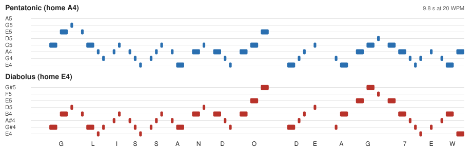

# The CW tail

Somebody who stumbles on Glissando on the air hears a pretty melody and has
nothing to search for. So, by default, a Glissando transmission can end by
spelling it out in Morse code: **GLISSANDO DE AG7EW**, with your own call.
Each dit and dah is sung on a note of the scale being sent. The CW
Glorifier chooses the notes.

## What it sounds like

The timing is standard Morse, so anyone who reads CW by ear can copy it.
Only the pitch changes, and it follows the rules long and short notes
follow in a tune:

1. **A dah leaps to a note of the scale's home chord.** In the pentatonic
   scale that is A minor (A, C and E). In diabolus it is E major (E, G#
   and B). The wholetone scale uses the augmented chord E, G# and C, and
   the diminished scale the diminished seventh E, G, A# and C#.
2. **A dit steps to the next note of the scale**, the way a passing note
   joins two chord notes.
3. **Letters take turns going up and going down**, and turn back before
   they run off either end of the eight notes, so each word has a rise and
   fall like a phrase.
4. **Each word starts on the home note** (A4 in the pentatonic scale, E4 in
   the others) **and the last note lands on it**, so the tail ends on a
   cadence rather than a question.
5. **Each note glides in from the one before over 20 ms**, the Glissando
   swoop, and starts and stops over 5 ms so the keying makes no clicks.

The same text in the same scale always gives the same tune. In the Presto
duet the tail is sung by the low voice alone.

## Straight CW

The Tail choice also offers **CW, straight on E4+D5**. It sends the same
text at the same speed and interval, but as plain Morse: every dit and dah
is E4 and D5 sounding together, the two notes of the opening chord, which
are in every scale. It is easier to copy by ear, and a CW decoder tuned to
either note can read it. The two notes share the transmitter's peak power,
so each is 6 dB below a glorified note.

## Settings

In Preferences, Options, Modem, under Text Chat:

| Setting | Default | |
|---|---|---|
| Open each Glissando transmission with a chord | on | E4 and D5 for 0.6 s; see [CHORDS.md](CHORDS.md) |
| Tail | CW, glorified | Off, Chord (every note of the scale for one bar), CW glorified, or CW straight on E4+D5 |
| CW text | `Glissando de <MYCALL>` | `<MYCALL>` becomes the callsign on the Station tab |
| CW speed | 20 WPM | 10 to 40 |
| At most once every | 10 minutes | 0 plays it on every transmission |

Under the settings the box shows what will be sent and how long it takes,
or why the chord will be sent instead. That happens when no callsign is
set, when nothing in the text has a Morse code, or when the tail would run
longer than 15 s. Characters Morse has no code for are skipped. The
accepted characters are letters, digits and `/ ? . , = + - @`.

With Tail set to CW, the first transmission ends with the CW tail. After
that, the tail plays again on the first transmission once the set number of
minutes has passed. The closing chord ends the transmissions in between.

## Why at most every ten minutes, and why 20 WPM

At 20 WPM, "GLISSANDO DE AG7EW" is 164 Morse units, counting the word space
that separates it from the last frame. That is 9.8 s. A ping or an
acknowledgement at Presto is only 7.8 s with its chords, so a CW tail on
every one would more than double it. Once every ten minutes keeps the chat
brisk.

Ten minutes is also how often US stations must identify (47 CFR
97.119(a)). US rules let an automatic device send a CW identification at up
to 20 WPM (97.119(b)(1)), so the default speed stays there. With both
defaults, the tail can serve as the station's identification in plain CW.
The callsign inside Glissando's own frames is not one of the digital
formats 97.119(b)(3) lists for identification. This is a reading of the
rules, not legal advice: check what applies to your licence.

## Chat timing and carrier sense

The tail's length counts toward the chat's air-time estimates in place of
the closing chord. So the Send button's on-air time, the acknowledgement
waits and the split before the 180 s transmit time-out all allow for it on
the transmissions that carry it. The tail stays on the scale's notes, and
its longest silence is a word space (0.42 s at 20 WPM). A listener's chord
listener therefore keeps the channel marked busy right through it, and
other stations hold off until it ends.

The receiver finds frames by their motifs, and the tail never sings one. A
test checks that a tail alone gives no decode, clean or in noise, at any
tempo and in any scale.

## Code

`modem/GlissandoCw.h` holds the Morse table, the Glorifier (`cwTune`) and
the tail's audio (`cwTail`). `modem/test/GlissandoCwTest.cpp` covers the
Morse timing (PARIS is 50 units), the rules above, the audio and the
no-decode check. `TextMessagingModem` picks the chord or the tail for each
keying, and the visi-scope prints the tail's notes as ships while it goes
out.
