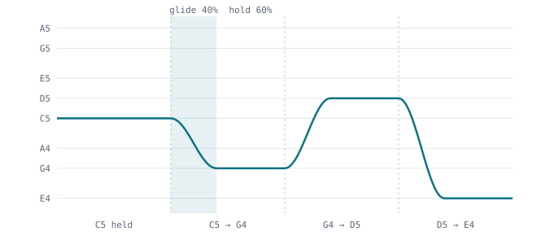
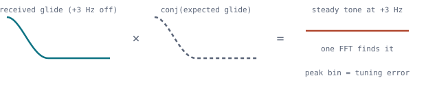
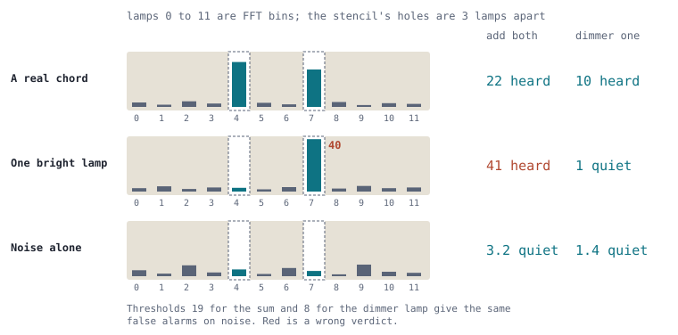

# How Glissando hears a chirp

Does the Glissando receiver detect chirps or continuous tones? This page
answers that from the C++ modem in [modem/](../modem/) and then walks
through the maths one idea at a time. You don't need a DSP background to
follow it.

> **Short answer: both, because it listens for the whole melody.**
>
> Every symbol glides for its first 40% and holds a note for the other 60%.
> The receiver compares the audio with a stencil of the complete shape,
> glide and hold together, so the glide's energy counts toward every
> decision. To find where a frame starts, it uses the glides the same way
> LoRa uses chirps. To decide which note was sent, it works more like an
> FT8 tone detector, because most of each symbol is a steady note and the
> note carries the data.

*The first four notes of the Costas opening motif, drawn to scale on a
log-frequency axis. At Adagio each symbol lasts 640 ms, so each glide takes
256 ms and each hold 384 ms. The shape comes from `pitchTrack()` in
[GlissandoModem.cpp](../modem/GlissandoModem.cpp).*

Line references below are to [GlissandoDemod.cpp](../modem/GlissandoDemod.cpp)
as of September 2026. The function names will stay put longer than the
line numbers. Lesson 6 leaves the frame decoder for the listener that hears
the opening chord, in [GlissandoChord.cpp](../modem/GlissandoChord.cpp).
Lesson 7 returns to it, for the bits a receiver can guess before it
decodes, and Lesson 8 is about the chat text itself: how the ham table and
Huffman coding spend fewer bits on it. Lesson 9 adds up the copies of a
frame that is sent more than once (all October 2026).

## Lesson 1: a matched filter is a stencil

Suppose you know exactly what a signal looks like, sample by sample. The
best test for "is it there?" is to multiply the received audio by the
expected waveform, sample by sample, and add up the products. That sum is
called a correlation, and a receiver built around it is a *matched filter*.

Here is why it works. Where the audio matches the stencil, every product
points the same way, so after L samples the signal has grown L times.
Noise points in random directions, so its sum wanders like a drunk walking
home and grows only as the square root of L. One Adagio symbol is 30,720
samples at 48 kHz, so the signal gains on the noise by a factor of about
175 in amplitude. That is the whole secret of weak-signal modes. The
waveform itself holds no magic; what matters is a long, patient comparison
against something you already know.

$$y = \sum_n r[n]\cdot\overline{t[n]} \qquad r = \text{received audio},\; t = \text{template}$$

We work with complex (I/Q) audio, so "multiply by the expected waveform"
means multiply by its complex conjugate. The conjugate spins the template's
phase backwards, so a matching signal ends up standing still, pointing one
way, and adds up. In our code that inner loop is `dotConj()`
([L71](../modem/GlissandoDemod.cpp#L71)).

## Lesson 2: in plain noise, the shape does not matter

This part surprises most people. Against white noise, how well you detect
a known waveform depends on only two things: the energy in the symbol
(power times duration) and how different the candidate symbols are from
one another. A steady tone, a chirp and a bird call of the same energy are
equally easy to detect.

So LoRa's famous sensitivity does not come from chirping. It comes from
very long symbols with a large time-bandwidth product, detected by a
matched filter. FT8 reaches similar depths with plain tones for the same
reason. That is why our simulated thresholds track FT8 and JT65 even though
most of each symbol is a held note: Allegro sits about 0.5 dB behind FT8
and Adagio matches JT65 ([DESIGN.md](DESIGN.md)).

What chirps really buy is protection against things that are not white
noise: a carrier parked on your frequency, echoes you want to separate in
time, and a frequency offset you don't know yet. Lesson 3 is about the last
one.

## Lesson 3: dechirping, the LoRa trick

A matched filter needs the template to line up in both time and frequency.
We don't know when a frame starts or how far off tune the other station is,
so a naive receiver would try every combination, one correlation each.
Dechirping gets all the frequency guesses for the price of one.

Multiply the received glide by the conjugate of the glide you expect. If the
timing is right, the sweep cancels and what is left is a steady tone sitting
at the tuning error. One FFT then measures every possible tuning error at
once, because an FFT is a bank of tone detectors.

*Dechirping a C5 to G4 glide. The sweep cancels and only the offset
survives. The sync search does this for all 21 motif notes of a frame.*

That is exactly our sync search. Each of the 21 known motif notes is
multiplied by the conjugate of its known glide, the result goes through one
FFT, and the powers are added across all 21 (`SyncSearch`,
[L321–L392](../modem/GlissandoDemod.cpp#L321-L392)). The search slides
along in steps of an eighth of a symbol, keeps the best peaks, then
re-searches finely around each one (`syncSearch()`,
[L408–L516](../modem/GlissandoDemod.cpp#L408-L516)). With automatic scale
detection it does this once per scale.

LoRa uses the same trick for its data. Every LoRa symbol is the same chirp
started at a different point in its sweep; dechirp it and the data appears
as a tone whose frequency is the symbol value. We don't do that for data,
because our data symbols are different notes rather than shifted copies of
one chirp.

## Lesson 4: why chirps are fussy about timing

Here is the catch in Lesson 3. A chirp that arrives a little late looks
almost exactly like a chirp that is a little off frequency, because at any
instant its pitch is where the on-time chirp's pitch was a moment earlier.
The sweep couples time and frequency. Radar makes use of this; for us it
means a glide gives a sharp timing fix but can mistake a timing error for a
tuning error.

The receiver handles this by splitting the job (`refineSync()`,
[L560–L630](../modem/GlissandoDemod.cpp#L560-L630)):

- **Time** is refined to the exact sample on the sync glides, where the
  sweep makes the correlation peak narrow.
- **Frequency** is refined on the held part of every note in the frame,
  where a steady tone has no coupling between time and frequency.

The glide and the hold each do the half they are good at. The prototype
showed why sample-accurate timing matters: at Adagio, a timing error of
1.25 ms already cost 1.5 dB.

## Lesson 5: deciding the note with 64 stencils and a trellis

Once the frame is found, each symbol is compared with every possible glide:
from any of 8 notes to any of 8 notes, 64 stencils in all (`correlate()`,
[L641–L671](../modem/GlissandoDemod.cpp#L641-L671)). Each stencil covers the
full symbol, glide plus hold, so it collects all of the symbol's energy. The
code saves work because every stencil ending on the same note shares the
same hold, but mathematically each one is a full-length matched filter.

Two refinements matter:

- **Non-coherent detection.** We never know the absolute phase of the other
  station's audio, so the receiver keeps only the power of each
  correlation, |y|², and turns it into a likelihood with the Bessel
  function formula for a known shape with unknown phase
  ([L788–L794](../modem/GlissandoDemod.cpp#L788-L794)).
- **The trellis.** A glide depends on the note before it, so symbols are not
  independent. The receiver runs the BCJR algorithm over the note sequence,
  which weighs every possible path through the melody at once
  ([L796–L833](../modem/GlissandoDemod.cpp#L796-L833)). This is how the
  glide's 40% of the energy gets used for data: a stencil only matches fully
  when both its start note and its end note are right, and the trellis
  supplies the start note from its neighbour.

About 1 in 8 data symbols repeats the previous note. When it does, the
symbol is a held tone for its whole length and the stencil is a plain tone
detector. The other 7 in 8 carry a glide.

## Lesson 6: hearing the opening chord, two lamps and an "and"

Lessons 1 to 5 decode a frame. Before any of that, the chat needs a much
quicker answer to a much simpler question: is somebody keying right now?
That is carrier sense, and it is what keeps two stations from talking over
each other. Every transmission opens with two notes played together for
0.6 s, E4 (329.63 Hz) and D5 (587.33 Hz), and the chord listener's only job
is to notice that pair ([CHORDS.md](CHORDS.md)). The interval is a minor 
seventh: E4 and D5 are the one pair of notes all four scales share, so a 
single test covers every scale.

### Eleven lamps and a stencil

Picture it this way: lay out a row of lamps, each one lit by how much
sound there is at its pitch. Cut a cardboard stencil with two holes the
chord's distance apart, slide it along the row, and at each position ask
whether light shows through both holes.

That picture is very nearly the code. The lamps are the bins of a Fourier
transform (the same tone-detector bank as in Lesson 3). Every tenth of a
second the listener takes the last 0.6 s of audio, exactly one chord long,
and runs an 8192-point FFT on it at 8 kHz, so each lamp is about 0.98 Hz
wide. The two holes are 257.7 Hz apart, about 264 lamps. Sliding the
stencil is the tuning search: the other station may be off tune by up to
25 Hz either way, so the listener reads the pair at 51 positions one lamp
apart. Like the dechirp in Lesson 3, one FFT serves all 51; sliding the
stencil costs two lookups per position, not another transform.

Each lamp is measured in units of the noise. The listener takes the median
lamp between 200 and 3000 Hz, which a handful of loud signals can't move,
and scales it to the average brightness of a noise-only lamp (for noise, the
median is ln 2 of the mean). After that, a lamp reading 8 is eight times
as bright as noise usually makes it, whatever the audio level.

### Where adding the two holes breaks down

The obvious test adds the light from both holes and compares the total with
a threshold. Jeff spotted the flaw: what if one lamp is blazing and the
other is dark? A carrier on 587 Hz, or one FT8 tone, fills a single hole so
brightly that the sum clears any sensible threshold. Adding is an "or": it
says yes if either note is loud enough.

*The stencil's holes over lamps 4 and 7 (drawn three lamps apart; on the
air they are 264 apart). The two tests are set to the same false-alarm rate
on noise. Only the dimmer-lamp test rejects the single bright lamp.*

What we want is an "and": E4 is lit *and* D5 is lit. The listener gets one
by judging the pair on its dimmer lamp. At each stencil position it takes
the smaller of the two readings and asks whether that is over 8
(`CHORD_THRESHOLD`). A single blazing lamp can't pass, because the other
hole is still showing only noise.

### What the "and" costs, and why it is cheap

You might expect two separate yes-or-no tests to throw away sensitivity
compared with pooling the light. A little, but not much. On noise, a lamp's
reading follows an exponential law: the chance it reaches 8 is e⁻⁸, about
1 in 3000. Both lamps of one position must do so at once, so a false chord
at that position has chance e⁻⁸ × e⁻⁸ = e⁻¹⁶, about 1 in 9 million. The
summing test gives the same false-alarm rate with a threshold of 19 on the
total. With both tests set to that rate, a simulation of a chord in noise
gives:

| | Sum of both lamps over 19 | Dimmer lamp over 8 |
|---|---|---|
| Chord heard half the time | each note 9.1 dB over a noise lamp | each note 9.8 dB over a noise lamp |
| One lamp at 30 dB, noise in the other hole | heard every time | heard 0.04 % of the time |

So the "and" costs about 0.7 dB on a real chord and turns the blazing-lamp
case from always wrong to almost never. Two things make it cheap. The
transmitter sends both notes at the same level, so on a clean path the
lamps really are equal and nothing is lost by looking at the dimmer one.
And the threshold can be low, 8 rather than something like 16, because two
coincidences have to happen together before noise can fake a chord.

With 51 positions and ten windows a second, the listener makes about 510
of these tests every second. At 1 in 9 million each, noise alone makes a
false chord roughly once every five hours, before the checks below remove
most of those too.

### Four more questions before a chord counts

A busy band isn't white noise. FT8 tones, RTTY, carriers and voices can
light both holes at once by accident, and early versions of the listener
called that a chord ten times a second. So a position that passes the
dimmer-lamp test must also pass four checks (`ChordListener::analyse()`,
[GlissandoChord.cpp L224–L241](../modem/GlissandoChord.cpp#L224-L241)):

- **Nearly even.** The brighter lamp may be at most 10 times the dimmer
  (`MAX_NOTE_RATIO`). A strong carrier with a noise spike that happens to
  reach 8 in the other hole fails here. Ten times leaves room for fading
  to treat the two notes differently.
- **Just switched on.** The window that ended where this one starts, all
  of it from before a chord could have begun, must have shown both lamps at
  under half the dimmer reading now (`ONSET_RATIO`). A station keys from
  silence; a signal already sitting on E4 is not a new chord.
- **A pinpoint, not a lit wall.** Each lamp must be at least 4 times the
  average of the lamps 4 to 10 Hz either side of it (`PURITY`, `purity()`).
  A held note is a sharp line a couple of lamps wide. Voices and the
  wandering tones of FT8 smear their light across the neighbours.
- **Lit the whole time.** Each note must sound in both halves of the
  0.6 s window (`STEADY_SHARE`, `steady()`). Two short signals that each
  touch a hole for part of the window are not a chord.

The position that passes everything with the brightest dimmer lamp wins,
and its tuning becomes the station's tuning for what follows.

### After the chord: a stencil with eight holes

Once a chord is heard, the channel stays busy for as long as the melody
continues. Now the stencil has eight holes, one for each note of a scale, at
the tuning the chord gave. A melody plays one note at a time, so the
listener adds the eight lamps (this time the sum is right, since only one
note sounds at once) and does that for all four scales. The scale that has
been brightest since the chord is the one being sung. Its total must reach
26, about 1.7 times what noise alone makes, and also 1.5 times what that
same stencil usually showed during the 15 s before the chord, so a signal
that was already sitting on those notes doesn't count as melody.

The channel is released 2.5 s after the last bright reading
(`HOLD_SECONDS`), which spans the gaps between notes. On its own a chord
holds the channel for at most 75 s, enough for the first frame of an Adagio
melody to decode. Every frame that does decode starts those 75 s again
(`heardFrame()`), so a long keying is followed to its end, while a chord
the band made up by accident lets go after 75 s.

Measured over 20 minutes of a busy band, with a dozen FT8 signals and a
voice, these checks took the channel from busy all of the time to busy 6%
of the time, never for more than 7.9 s at once ([CHORDS.md](CHORDS.md)).
Below about −14 dB the chord is too faint for the lamps to stand out at
all, and carrier sense falls back on decoded frames.

## Lesson 7: filling in some of the answers before decoding

Lesson 5 ends with a likelihood for every bit of the frame. The
error-correcting code then picks the most likely 77 payload bits and 14 CRC
bits. This lesson is about what the receiver can do when it already knows
some of those bits before it starts.

**A crossword with some squares filled in.** Think of the decoder as solving
a crossword. The 91 bits are the answers, and the convolutional code is the
grid of clues: every coded bit the radio hears depends on seven neighbouring
answer bits, so each answer is cross-checked by several clues. Noise smudges
some of the clues. If someone fills in some answers for you before you
start, the smudged clues around them stop being ambiguous, and the
remaining answers come out right even when the handwriting is worse.

In the decoder, the Viterbi algorithm walks a trellis of 64 states, one step
per bit, and at every step each path forks two ways: this bit is a 0, or a
1. Where a bit is known, the decoder simply closes the fork that disagrees
(`decodeFrame()`, [GlissandoFec.cpp
L141–L156](../modem/GlissandoFec.cpp#L141-L156)). It no longer needs the
noisy evidence for those bits, and the code's redundancy all goes to the
bits still in doubt. FT8 decoders use the same trick and call it *a priori*
(AP) decoding.

*Which payload bits a listener can predict, without anything changing on
the air. Teal bits are guessed; white bits must be decoded.*

**Where the guesses come from.** Two kinds of bit are predictable:

- **Zero padding.** A message is cut into 9-byte pieces, and the last piece
  is padded out with zero bytes. If the last frame carries one byte of text,
  64 of its 77 bits are zeros. The receiver guesses 64 zero bits, then 48
  (`PADDING_HYPOTHESES`, [GlissandoDemod.cpp
  L67–L76](../modem/GlissandoDemod.cpp#L67-L76)).
- **Replies.** Once you have sent something to AG7SU, the first frame of
  AG7SU's answer must start with a known segment index, your callsign's
  hash and AG7SU's packed callsign: 52 of its 77 bits. Your receiver learns your
  callsign and who you sent to from your own transmissions. It guesses a
  reply from each of the three stations you sent to most recently in the
  last 15 minutes, then a frame to you from anybody, which pins 23 bits
  (`expectedFrames()` in
  [TextMessagingModem.cpp](../app/src/pipeline/TextMessagingModem.cpp) and
  `FrameCodec::expectedFrameStart()` in
  [FrameCodec.cpp](../app/src/text_messaging/FrameCodec.cpp)).

**The CRC is the referee.** A guess is never simply trusted. The receiver
first decodes the frame with no guesses. Only if the CRC fails does it try
each guess in turn ([GlissandoDemod.cpp
L1068–L1083](../modem/GlissandoDemod.cpp#L1068-L1083)). A wrong guess
forces the decoder onto wrong answers, and the 14-bit CRC rejects the result
16,383 times in 16,384. That last 1 in 16,384 is the price: every guess is
another lottery ticket for pure noise to pass the CRC. So the receiver holds
only a handful of guesses, never tries them on a candidate below the Es/N0
floor, and the cost stays small. In 10,000 searches of pure noise at Presto
with guesses installed there was one false decode, about the same as
without them.

**What it buys.** Measured at Presto in white noise, 200 frames per point,
as the drop in signal needed to decode half the frames:

| Frame | Bits known | Code alone | Whole receiver |
|---|---|---|---|
| Last frame of a message, one byte of text | 64 | 2.1 dB | 0.8 dB |
| Last frame of a message, three bytes of text | 48 | 1.2 dB | 0.45 dB |
| First frame of a reply from the station you're working | 52 | not measured | about 0.5 dB |
| First frame addressed to you from a stranger | 23 | not measured | about 0.1 dB |

Before the header was packed to the bit (Lesson 8) a reply's first frame
had 71 guessable bits and gained about 1 dB, and a stranger's 31 bits about
0.3 dB. The packed header leaves less to guess, but a pong or
acknowledgement is now one segment instead of two. Near the threshold that
matters more: when each segment has an even chance of decoding, a
two-segment burst arrives only one time in four.

The whole receiver gains less than the code alone because guesses only help
once the frame has been found. At the weakest signals many frames are lost
earlier, at the sync search of Lessons 3 and 4, and knowing what a frame
says does not help find it.

Two properties make this safe to add. Nothing on the air changes, so every
station benefits whatever version the sender runs. And it only ever adds a
second chance: a frame that decodes plainly decodes exactly as before, and
a station that fades in mid-message still reads it without any guesses at
all.

## Lesson 8: fewer bits for the letters hams use

Lessons 1 to 7 are about hearing each bit. This one is about needing fewer
of them. Until October 2026 every character of chat cost eight bits, the
same for a space as for a `Q`. Glissando now codes text with a table drawn
from ham chat, and a typical message takes about 38% fewer frames.

**Morse got there first.** Samuel Morse gave `E`, the commonest letter in
English, a single dot, and `Q` four elements. Common letters short, rare
ones long: on average a message gets shorter. In 1952 David Huffman showed
how to build the best possible code of this kind from a table of how often
each character turns up. The result is a *Huffman code*.

*The same 25 characters as plain bytes and as ham-table Huffman codes. Each
box is as wide as the bits it costs.*

**Building the ham table.** The code lengths live in `SYMBOL_BITS` in
[HamTextTable.h](../app/src/text_messaging/HamTextTable.h), generated by
[gen_table.py](../prototype/ham_table/gen_table.py). They come from
counting the characters in 94 typical chat lines (CQs, signal reports,
names, QTHs, rigs and antennas), blended 70/30 with ordinary English prose,
so a word missing from the small sample is not punished. Out of that come:

| Characters | Bits each |
|---|---|
| space | 3 |
| e t a o i n | 4 |
| most other lower-case letters (j, q, x and z cost more) | 5 to 7 |
| capitals and digits | 7 to 10 |
| rare punctuation | up to 13 |
| anything else (é, emoji) | a 12-bit escape code plus the 8-bit byte |

Chat in mixed case averages about 5 bits a character. The same lines typed
in all capitals average about 7, still less than plain bytes.

**Whole phrases as one symbol.** A few phrases hams send all the time get a
code of their own, like a Morse prosign that runs letters together. The
list is in [phrases.txt](../prototype/ham_table/phrases.txt), matched
exactly, capitals and leading space included:

| Phrase | Bits as one symbol | Bits spelled out |
|---|---|---|
| "CQ CQ" | 11 | 35 |
| " the" | 7 | 17 |
| " you" | 8 | 20 |

The encoder codes the longest phrase that starts at each character. In the
COMMS window, those phrases get a faint red background as you type, so you
can see which parts of a message ride as one symbol.

**No commas needed between codes.** A Morse operator hears the gaps between
letters. A Huffman decoder has no gaps: the bits arrive end to end. It works
because no code is the start of another one, so the decoder reads bits until
they spell a code, writes the character, and starts again. Picture the table
as a tree: each bit picks the left or right branch, and every character sits
on a leaf.

**Why the table never changes.** Cleverer schemes adapt to the
conversation: zip-style compression remembers what was said earlier, and a
*context model* guesses each letter from the ones before it. Both shrink
text further, and both fail a station that fades in part way through,
because it never heard what the coding depends on. Jeff's rule for
Glissando is that a station that hears only part of a message must still
read that part and the sender's callsign. With one fixed table, every frame
decodes on its own. The table is the same at both ends because it is
written into the program, which also means that changing it is a protocol
change.

Two more details keep partial copy working:

- **No code straddles a segment.** Glissando carries a frame 9 bytes (72
  bits) at a time. A code that would cross into the next segment starts
  there instead, so a segment heard after a lost one still reads. This
  costs about 1% more frames.
- **Padding reads as nothing.** The rarest code in the table is all zero
  bits, 13 of them. It means "the rest of this segment is empty", and it is what zero
  padding spells. So the frame needs no length field, and the padding stays
  zero for Lesson 7's guesses.

**A smaller header too.** Every frame also carries a header saying what it
is, who it is for and who sent it. That header was 15 bytes. It is now
packed to the bit:

- the frame type in 4 bits;
- a 20-bit hash of the destination callsign;
- the sender's callsign in 28 bits, packed as FT8 packs it, when it is
  standard: a prefix of one or two characters, a digit, and up to three
  letters. A portable or other callsign takes 48 bits;
- a 10-bit message number, then the fragment fields.

A ping, pong or acknowledgement from a standard callsign is now exactly 72
bits, one segment instead of two, so at Presto a pong takes about 7 seconds
instead of 14. When Auto acknowledge is off, the type field says so.

**What it adds up to**, counted on the same 94 chat lines:

| | Frames | Change |
|---|---|---|
| 8-bit text, 15-byte header (0.3) | 573 | |
| Ham-table Huffman, packed header | 356 | 38% fewer |
| Ping, pong or acknowledgement | 1 segment | was 2 |

The new frames do not work with Glissando 0.3 and older. The type values
are chosen so that neither build mistakes the other's frames for its own:
each drops them as noise.

## Lesson 9: adding up the copies of a repeat

A frame too weak to decode is not wasted. If the same frame is sent again,
a retry or a second ping, the receiver can add what it heard the first time
to what it hears the second time, and decode the sum. JT65 and Q65 decoders
call this averaging.

**Stacking photographs.** Astronomers photograph a faint galaxy many times
and stack the pictures. The galaxy is in the same place in every picture,
so it adds up; the grain of each picture is random, so it partly cancels.
Two stacked pictures show a galaxy that neither shows alone.

The receiver stacks the bit likelihoods of Lesson 5. For each candidate
that fails to decode it keeps the 195 numbers, one per coded bit, that say
how sure it was of a 0 or a 1 (`SoftFrame`, [GlissandoInternal.h](../modem/GlissandoInternal.h)).
When a later candidate also fails, it adds the two sets of numbers and
hands the sum to the decoder, with Lesson 7's guesses as usual
(`StreamingReceiver::Impl::average()`, [GlissandoReceiver.cpp](../modem/GlissandoReceiver.cpp)).
Where both copies leaned towards a 0, the sum leans harder; where the noise
pushed one copy the wrong way, the other usually outvotes it.

**Which copies belong together?** The receiver does not know which earlier
candidate, if any, was the same frame. So it only stacks copies that:

- are at the same tempo, voice and scale, within 3 Hz of each other;
- started at least a frame apart (two searches that overlap find the same
  frame twice; that is not a repeat);
- looked like a signal when heard: a measured Es/N0 of 1.3 or more, which a
  real frame 1.5 dB under the threshold reaches 95% of the time and a noise
  peak about one time in six;
- agree. The receiver correlates the two sets of likelihoods. Copies of the
  same frame lean the same way on most bits: 0.2 to 0.4 at these signal
  levels. Different frames and noise score about 0, give or take 0.07. Only
  pairs scoring 0.2 or more are added.

Copies are kept for ten minutes. A copy that helps decode a frame is
dropped, so the next repeat starts afresh.

**What it gains.** At Presto, measured on a stream of noise with a frame
sent two or three times, each copy starting 12 to 27 seconds after the last,
40 trials per point:

| Signal (dB in 2500 Hz) | One copy decodes | Two copies | Three copies |
|---|---|---|---|
| -18.0 | 38% | 75% | |
| -18.5 | 5% | 48% | |
| -19.0 | 0% | 28% | 45% |
| -19.5 | 0% | 5% | 20% |

Half of all frames decode at about -17.6 dB from one copy, -18.5 dB from
two and -18.9 dB from three: about 0.9 dB and 1.4 dB of gain. Sixty minutes
of plain noise, listened to at every tempo, gave no false decodes.

Why not the full 3 dB that doubling the signal suggests? Two reasons. The
receiver detects each note by its power, not its phase, and power detection
loses more of a weak signal than it keeps, so each copy brings in less than
its share. And each copy must still be found on its own: the sync search of
Lesson 3 has to pick it out of the noise before there is anything to stack.
A slower "Largo" gear, on the roadmap, could stack copies whose timing is
already known, which avoids the second loss.

## What glide-then-hold gains and gives up

| | Pure chirp (LoRa) | Glissando glide + hold |
|---|---|---|
| Sensitivity in white noise | Set by symbol energy | Same rule; thresholds near FT8 and JT65 |
| Finding the frame | Dechirp and FFT | Same trick on the 21 motif glides |
| Carrier or whistle on a note | Spread over the band, barely hurts | Lands on a held note and can steal it |
| Tuning error vs timing | Coupled; needs extra care | Holds measure tuning cleanly |
| Bandwidth | Whole sweep, every symbol | 330 to 880 Hz, fits SSB easily |
| How it sounds | Buzzing sirens | A melody |

The one real thing we give up is resistance to narrowband interference. A
pure chirp spends only a moment at any one frequency, so a carrier at 440 Hz
barely touches it. Our notes rest 60% of the time in a slot about 3 Hz wide
at Adagio, so a carrier sitting on one of our notes will hurt the symbols
that land there. The error-correcting code covers some of that. This is
inferred from the design, not measured; a bench run with a carrier on A4
would put a number on it.

## The prototype does the same

The C++ modem is a port of [prototype/glissando.py](../prototype/glissando.py)
and uses the same maths: dechirped sync search, sample-accurate timing on
glides, frequency on holds, 64 full-symbol stencils and BCJR. The port adds
speed-ups that don't change the result (summing the dechirped audio in
blocks before a shorter FFT, sharing hold correlations) and floors that stop
silence and hum from decoding (see the notes at the top of
[GlissandoDemod.cpp](../modem/GlissandoDemod.cpp)).
